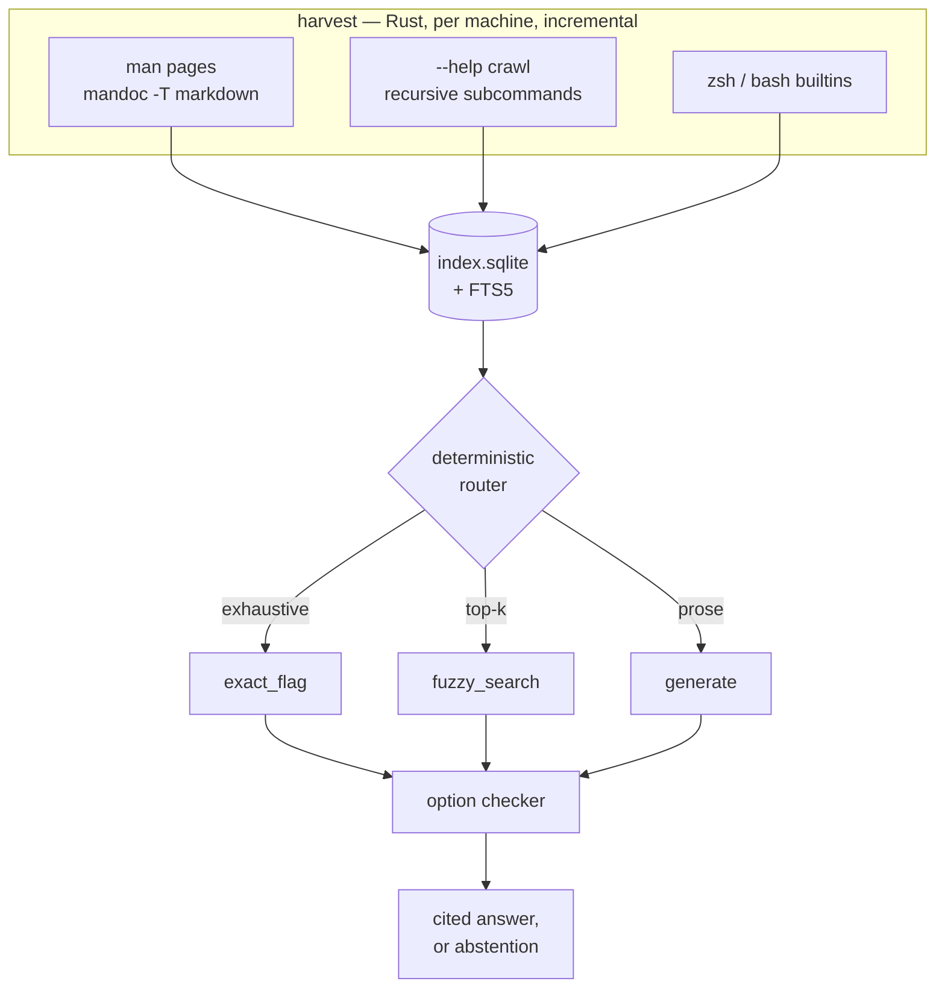

# shelliq — a local, verifiable CLI assistant

## The complaint

"Is it `-r` or `-R`?" Every shell user loses minutes a week to this. The fix does not
require intelligence — it requires the man page on _this_ machine, indexed and queryable.

The original framing was "pretrain an LLM on all my man pages with JAX." Measurement
reshaped that, and the reshaping is the interesting part.

## What the numbers said

- The man corpus here is ~5,200 pages, **~8–25M tokens**. Chinchilla-optimal for that is a
  ~1M-parameter model. Anything pretrained from scratch on it emits fluent man-page prose
  and _invents flags_ — the exact failure being solved for.
- Flags extract **deterministically**. The P0 parser reproduces `curl --help all` exactly —
  258 long flags, zero difference in either direction — and `ls --help` exactly at 44.
  (The figures quoted earlier in planning, `curl` 396 and `rsync` 382, were an overcount:
  that heuristic also matched flags _mentioned inside description bodies_, such as curl's
  "--alt-svc can be used several times". The measured numbers are in
  `crates/harvest/tests/real_pages.rs`.)
- Emitting command _syntax_ is easy (small formal grammar). Understanding **English** is
  the hard half, and it cannot come from 8–25M tokens of terse man prose. So: fine-tune an
  existing small model rather than start cold.
- **`ollama`, `kubectl`, `cargo`, `uv`, `pnpm`, `ruff`, `just` have no man pages at all.**
  The harvester must also crawl `--help`.
- Shell history is full of **bundled short flags** — `-fsSL`, `-sirn`, `-xzf`, `-LsSf`. The
  option checker must decompose bundles, because a wrong case hides invisibly inside
  `-sirn`.

**Architecture — facts and fluency separated:**

| Concern                             | Owner                               | Why                                 |
| ----------------------------------- | ----------------------------------- | ----------------------------------- |
| Flag facts, case, args, subcommands | SQLite index, generated per-machine | Deterministic, exact, citable       |
| English → command shape             | Fine-tuned Qwen2.5-Coder-0.5B       | Needs pretrained language ability   |
| Whether each option spelling exists | Option checker, index-backed        | Catches invented and miscased flags |

The trust story is not "it's local" — a local 0.5B alone is _less_ reliable than cloud
Copilot. It is that **every option spelling is reconciled against the man page on this
machine and carries a citation**. Local is the privacy story, not the accuracy story.

**That guarantee is narrow, and the plan previously overstated it.** The checker establishes
that a command name is indexed and that each literal option spelling exists for it with
roughly the right argument shape. It establishes nothing about whether the command does what
was asked, whether its operands are right, or whether running it is safe. See
[What the checker does not establish](#what-the-checker-does-not-establish).

**Why this beats what exists:** `tldr` is hand-written markdown, no model, answers only
pre-written questions. Warp AI and GitHub Copilot CLI are cloud calls to frontier models
with no man-page grounding — they know a generic GNU world and will hand you GNU `sed -i`
on macOS. None read the man pages on _your_ machine at _your_ installed versions.

## Footprint: what runs where

The 4090 is a **build-time** dependency, not a runtime one. Training happens once, here,
and ships a GGUF. No user ever needs a GPU.

| Tier              | Needs                        | Size         | Covers                                    |
| ----------------- | ---------------------------- | ------------ | ----------------------------------------- |
| **0 — no model**  | nothing but the binary       | ~8MB + index | `explain`, fuzzy flag search, Tab, verify |
| **1 — CPU model** | 0.5B GGUF, fetched on demand | +~500MB      | English → command                         |
| **2 — GPU**       | any CUDA/Metal device        | same file    | same, faster                              |

**Tier 0 is the default and handles the original complaint with zero inference.** It runs
on a Raspberry Pi. The model is not bundled, not required, and not linked into the default
build — it sits behind a Cargo feature and is downloaded only if asked for.

Measured, not assumed: `qwen2.5-coder:1.5b` with `num_gpu: 0` — **51 tok/s, 1.82s
end-to-end, correct answer** (`find /var/log -type f -mtime -2`). That is the _1.5B_ on
CPU. The 0.5B is 3× smaller, so Tier 1 has comfortable margin under 1s on a laptop.

**WebLLM is the sanity check.** It runs Qwen2.5-0.5B _in a browser tab_ over WebGPU/WASM.
Anything that fits a browser sandbox fits a native CPU process easily. Two consequences:
0.5B is already the floor worth targeting — there is no need for a smaller tier — and a
future browser demo is a real option, not a stretch.

### Laptops, iGPUs, and the M1 — inherit acceleration, don't build it

**shelliq embeds no inference engine.** Tier 1 speaks HTTP to whatever the user already
runs — `ollama` or `llama-server`. This is the decision that makes laptops a non-problem,
because those projects have already solved backend portability:

| Machine               | Backend               | Who provides it              |
| --------------------- | --------------------- | ---------------------------- |
| M1/M2/M3 MacBook      | Metal, unified memory | ollama ships it              |
| Intel Iris / Arc iGPU | Vulkan or SYCL        | ollama / llama.cpp ship both |
| AMD Radeon iGPU       | Vulkan or ROCm        | same                         |
| Anything else         | CPU                   | always available             |

Confirmed locally: `llama.cpp` carries `ggml-metal`, `ggml-vulkan`, and `ggml-sycl` as
**dynamically-loadable** backends alongside `ggml-cpu`, and ollama 0.32.1 is installed
here. Porting an iGPU backend is work someone else has already done and continues to
maintain; duplicating it inside shelliq would mean a Vulkan dependency, driver-variance
bugs across three vendors, and a far larger binary — in exchange for tokens on a model
small enough not to need them.

**On the iGPU specifically:** worth trying, not worth depending on. For a 0.5B answering in
~20 tokens, the wall-clock is dominated by process start and prompt ingest, not by
generation. An iGPU may roughly halve an already-sub-second number. The honest framing is
that it is a free win when the user's ollama picks it up automatically, and never a
requirement. That is exactly what the HTTP boundary buys.

**The M1 MacBook Pro is the best target in the fleet, not the hardest.** Unified memory
means the 500MB Q6_K model needs no host↔device copy, and Metal is mature. Tier 0 is even
better off there: `mandoc` ships with macOS, so the _preferred_ man parser is available on
the Mac while Linux needs an `apt install`. The Rust side is clean for `aarch64-apple-
darwin` — `rusqlite` (bundled C), `clap`, `shlex`, and `nucleo-matcher` are all portable,
and the default build links no CUDA. Real M1 numbers get measured in P5 rather than
guessed at here.

Embedding `llama-cpp-2` for a zero-dependency single-binary install stays available as a
later opt-in Cargo feature. It is not how v1 ships.

**[plan] The HTTP boundary is leanness bought with a trust boundary, and it needs a policy.**
"Speaks HTTP to ollama" is only a privacy win while that endpoint is on this machine.
Nothing in "HTTP" prevents a configured base URL, an `HTTP_PROXY` in the environment, or a
302 from shipping the user's shell buffer — which routinely contains hostnames, paths, and
occasionally credentials — to someone else's server. Invariant 15 would be violated by
configuration alone. So:

- **Loopback or a Unix socket only, by default.** A non-loopback endpoint is refused unless
  explicitly enabled, after a warning that says what gets sent.
- **Ambient proxy variables ignored** for local inference, and redirects disabled.
- **Request and response size and time limits**, with responses treated as untrusted input —
  a compromised or hostile local server is in the threat model.
- **Model artifacts verified against a pinned digest**, with published provenance.
- **Never pull a model from inside a shell widget.** A keystroke does not get to start a
  500MB download; fetching is an explicit command.

## Approach



Repo: `/home/brent/code/shelliq/` — name free on crates.io, PyPI, and npm.
Binary `shelliq`, aliased to `q` locally. It is read far more than typed; the primary UX is
keybindings.

**Status tags.** This document mixes shipped behaviour with intended design, so every
non-obvious claim carries one of these. An untagged statement is background, not a claim
about the code.

| Tag       | Meaning                                                  |
| --------- | -------------------------------------------------------- |
| `[done]`  | Implemented and measured on this machine                 |
| `[built]` | Implemented, not yet validated against an external gate  |
| `[plan]`  | Designed, not written                                    |
| `[exp]`   | Exploratory — may not survive contact with a measurement |

```text
crates/shelliq/   [done] clap CLI: explain, search, flags, index build/stats
crates/harvest/   [done] man parser   · [plan] --help crawler
crates/index/     [done] schema, FTS5 · [plan] fuzzy ranking, RRF, refresh, target identity
crates/verify/    [done] bundle splitter, flag checker · [plan] shell-syntax abstention
shell/            [built] shelliq.zsh (explain widget, fallback Tab completer) · [plan] shelliq.bash
training/         [built] nnx Qwen, HF loader, LoRA step, source builders, privacy/canary gates, held-out evaluation, Orbax resume, PEFT/HF/GGUF export · [plan] real fine-tune and benchmark
```

**Language split: Rust ships, Python trains.** A Rust static binary starts in ~2ms, so
index lookups are a plain process invocation — **no custom daemon**, which a Python runtime
would have forced (30–80ms interpreter start blows the <10ms Tab budget). macOS then needs
no Python at all. The interface between halves is the GGUF file and the SQLite schema.

Verified present: rustc 1.95, cargo 1.95, and crates `rusqlite` (86M dl), `shlex` (683M),
`clap` (1B), `ureq` (167M), `nucleo-matcher` (3M), `llama-cpp-2` (911k).

### 1. Index

```sql
-- [done] shipped in P0
commands(id, name, platform, section, version, synopsis, description,
         source_path, source_hash, parser_version, harvested_at)
subcommands(id, command_id, path, summary)      -- 'ollama list', 'git remote add'
flags(id, command_id, subcommand_id, short, long, arg_type, arg_required,
      description, group, source_line, rank_personal, rank_tldr)
examples(id, command_id, text, description, source)
examples_fts, flags_fts                         -- FTS5 over descriptions
```

`flags.short` preserves case exactly; `-r` and `-R` are distinct rows. That property alone
answers the original complaint with zero inference.

**[plan] What P0 got wrong about identity.** `UNIQUE (name, platform, section)` assumes one
`tool` per machine. One machine routinely has several: `/usr/bin/python` and a virtualenv's,
GNU and BSD `sed`, a Homebrew `grep` shadowing Apple's, a shell builtin shadowing both, and
a man page belonging to a different installation than the binary `PATH` actually resolves
to. A `linux|darwin` tag cannot represent that, and P0 does not even filter on the tag it
stores. Facts must bind to the **executable the shell would run**, not to a name:

```sql
-- [plan] P0.5
targets(id, name, exec_path, exec_kind, exec_hash, package, version,
        platform, arch, path_precedence, shadowed_by, first_seen, last_checked)
        -- exec_kind: file | builtin | alias | function | absent
sources(id, target_id, kind, path, content_hash, parser_version, harvested_at)
        -- kind: man | help | builtin-doc | tldr | info
example_flags(example_id, flag_id)   -- which flag an example's prose actually exercises
meta('schema_version')               -- migrations get tests, not hope
```

`commands` and `flags` then hang off `sources`, and a lookup resolves the current target
first, then selects facts for that target. Where man and `--help` disagree for the same
target, both stay visible and labelled; they are never silently merged, because the
disagreement is itself information (see `grep --colour` in Verification).

**[plan] Argument shape needs a mode, not two nullable columns.** `arg_type` plus a defaulted
`arg_required` cannot distinguish "takes no argument" from "takes an optional one", and says
nothing about attachment (`-A5` vs `-A 5` vs `--color=auto`), repeatability, cardinality,
arguments that begin with `-`, mutual exclusion, or whether a flag is global or scoped to a
subcommand. Replace both with an explicit `arg_mode` (`none | optional | required`) and an
`attachment` (`attached | separate | either`). Until that lands, the P0 guarantee is
**limited argument-shape checking**, and this document says so wherever it makes the claim.

### 2. Harvester

**Man pages** — parse source, not rendered text, where possible. `mandoc -T markdown`
handles both `man` and `mdoc` macros, so BSD/macOS pages work through the same path.
mandoc is **not installed here** (`apt install mandoc`; macOS ships it), so P0 ships the
validated rendered-text indentation heuristic and treats mandoc as an upgrade. Both paths
are validated against the same fixtures.

**[built] `--help` crawler** — covers the no-man-page tools. Run `TOOL --help`, parse the near
universal `-x, --xxx  description` shape that clap, cobra, and argparse all emit, extract
subcommands, recurse to depth 3 (`crates/harvest/src/help_crawler.rs`). Wired into
`shelliq index build`/`refresh` as a fallback when a name has no man page, and into the
schema's `subcommands` table (`Index::insert_help_crawl`); a caller opts a writable directory
into execution with `--allow-writable-path`. Validated end to end against `uv` (18 top-level
flags, queryable via `shelliq flags`/`search`) and `kubectl` on this machine. `kubectl` is a
real edge case worth naming: its root `--help` lists only subcommands and no top-level flags
at all (they live under `kubectl options`), so `shelliq flags kubectl` correctly reports it
has no top-level flags of its own rather than claiming it isn't indexed — but nothing yet
lets a caller query flags scoped to a specific subcommand path (`shelliq flags kubectl get`),
even though the schema and `insert_help_crawl` already store them that way.

**Containment, honestly.** This executes arbitrary binaries, and the P0 answer — 5s timeout,
setuid check, reviewed allowlist — was consent, not containment. `--help` is a convention;
a binary is free to load plugins, read credentials, open sockets, write files, or fork
before it ever looks at argv. The subcommand recursion also breaks the "only ever pass
`--help`" promise, since reaching `ollama list --help` means passing `list` too. What the
crawler must actually do:

| Risk                                             | Containment                                                                                                   | Status                                                                                                                                                                                                                                                                                                                                          |
| ------------------------------------------------ | ------------------------------------------------------------------------------------------------------------- | ----------------------------------------------------------------------------------------------------------------------------------------------------------------------------------------------------------------------------------------------------------------------------------------------------------------------------------------------- |
| Arbitrary startup behaviour                      | OS sandbox where available (bwrap/seccomp, `sandbox-exec`); documented as absent elsewhere                    | absent (not installed here); documented, not faked                                                                                                                                                                                                                                                                                              |
| Descendants outliving the timeout                | Own process group, kill the group, not the parent                                                             | done — `setsid` + `killpg`, unconditionally after `wait()` too, not only on timeout, so a `--help` that exits quickly while a background process it spawned lingers doesn't escape either; proved by a hostile fixture binary that forks, writes, floods stdout past the cap, and reads a closed stdin, in `crates/harvest/tests/help_crawl.rs` |
| Unbounded output exhausting memory               | Hard byte cap on stdout/stderr, truncate and mark                                                             | done                                                                                                                                                                                                                                                                                                                                            |
| Hanging on stdin                                 | stdin closed, never a tty                                                                                     | done                                                                                                                                                                                                                                                                                                                                            |
| Reading the user's config or cwd                 | Minimal environment, temporary working directory                                                              | done — breaks `rustup`'s `cargo` proxy, which needs `$HOME`; accepted trade-off                                                                                                                                                                                                                                                                 |
| Fork bombs                                       | Process-count limit (`RLIMIT_NPROC`)                                                                          | **withdrawn** — `RLIMIT_NPROC` is per-_uid_ on Linux, not per-process-tree; setting it low in the child crashed unrelated processes under the same uid. Needs a pids cgroup instead; not built. Bounded only by the timeout, same as P0.                                                                                                        |
| Allowlisted name resolving elsewhere later       | Approve a canonical path + `exec_hash`, recheck symlink target, owner, mode, and caps immediately before exec | done                                                                                                                                                                                                                                                                                                                                            |
| `PATH` full of user-writable venv/npm/cargo dirs | Reject writable-by-non-root locations by default, opt in per path                                             | done — `CrawlLimits.allow_paths`                                                                                                                                                                                                                                                                                                                |
| Terminal escape injection via help text          | Strip control characters before indexing _and_ before display                                                 | done on ingest; display path not yet wired                                                                                                                                                                                                                                                                                                      |
| Privilege                                        | Never run as root, and never from a root package hook                                                         | not enforced by the crawler itself; caller's responsibility                                                                                                                                                                                                                                                                                     |

**Lazy beats sweeping.** Harvest a command the first time it is asked about, not by walking
`PATH`. It serves the actual use case, avoids executing hundreds of irrelevant binaries,
keeps staleness checks cheap, and makes crawling third-party executables an explicit
per-command opt-in rather than one blanket consent.

**[plan] Staleness is detected, not assumed away.** Every source carries `content_hash` +
`parser_version`; every target carries `exec_hash`. A parser change invalidates rows the
same way a package upgrade does — `content_hash` alone would silently serve rows built by
old, buggier code. Lookups do a cheap identity check and report **fresh**, **possibly
stale**, or **stale**, each with stated evidence. `shelliq index --refresh` rebuilds into a
sibling database and swaps it atomically, and reconciles _removals_ as well as changes, so
an uninstalled tool stops being a fact.

The earlier claim that a locally generated index **"cannot drift"** was wrong and is
withdrawn. Local generation removes _shipping_ drift — no vendored GNU facts served on a
Mac — but the index goes stale the moment you `apt upgrade`, `brew install`, activate a
virtualenv, change `PATH`, or fix the parser. `DPkg::Post-Invoke` is also withdrawn: a root
package hook writing a user-owned index gets ownership and privilege exactly backwards. Use
a user-level lazy refresh instead.

### 3. Router — the speed win

Borrowed from `~/code/author-corpus-rag`, which solved the same shape of problem: a vector
search was asked how many articles an author wrote and confidently answered from top-k.
Exact questions must inspect the complete catalog, not infer totals from semantic matches.

shelliq routes **deterministically, before doing anything expensive**, and each route
carries an explicit coverage contract:

| Route          | Engine              | Coverage                 | Latency | Trigger                           |
| -------------- | ------------------- | ------------------------ | ------- | --------------------------------- |
| `exact_flag`   | SQLite lookup       | **Exhaustive**           | <5ms    | Input parses as a command line    |
| `fuzzy_search` | FTS5 + nucleo, RRF  | Non-exhaustive top-k     | <10ms   | Partial flag or description words |
| `generate`     | 0.5B, then verified | Unverified until checked | ~500ms  | Prose that isn't a command        |

Every decision records `rule_id`, `rationale`, and `matched_signals` — inspectable, with
**no invented confidence score**. A labeled `RoutingCase` set measures router accuracy the
same way that repo does.

The speed argument: the overwhelming majority of real queries — "what's the recursive flag
for grep" — never reach a model, never touch an embedding, and answer from SQLite in
single-digit milliseconds.

**Fusion without embeddings.** author-corpus-rag needs dense retrieval because prose is
semantic. Flag descriptions are short and keyword-dense, so shelliq fuses **FTS5 (BM25) and
nucleo fuzzy** by **reciprocal-rank fusion** — combining _ranks_, never raw scores, since
BM25 and fuzzy scores are not a common scale. This keeps Tier 0 at **zero ML dependencies**:
no embedding model, no vector index, no ONNX runtime. That is the single biggest leanness
decision in the design.

### 4. Display: making 258 flags navigable

Mostly, you don't show them. Four paths, one of which ever approaches the full set:

1. **`C-x C-h` explain a typed line** — bounded by what was written, 2–4 flags. Common case.
2. **Fuzzy over flag names** — `curl --ret` → 3 results.
3. **Fuzzy over flag _descriptions_** — search meaning, not prefix, so you need not know
   the name you forgot. See the measured limit below.
4. **Bare `curl -<TAB>`** — rank by `rank_personal`, cap ~15, footer `…243 more`.

```text
$ curl -<TAB>
  -s  --silent   ★     -o  --output   ★     -f  --fail  ★
  -L  --location ★     -H  --header   ★
  ─ your 15 most-used · …243 more, keep typing ─
```

`flags.group` preserves man page section grouping. Descriptions truncate to terminal width.

**Measured limitation — the showcase example does not work, and it is instructive.**

The original claim here was that typing "follow redirect" would find `-L, --location`. It
does not. curl's man page describes that flag as:

> (HTTP) If the server reports that the requested page has **moved to a different
> location** (indicated with a Location: header and a 3XX response code), this option makes
> curl redo the request on the new place.

The words "follow" and "redirect" never appear. BM25 over descriptions therefore returns
`--max-redirs`, `--post301`, and `--location-trusted`, but not `-L` itself. This is not a
ranking bug to be tuned away; man pages describe **mechanism**, and users search by
**task**.

Three remedies, cheapest first:

1. **Index tldr examples into `examples_fts`.** tldr's wording is task-oriented ("follow
   redirects") where man's is mechanism-oriented. This promotes the `examples` table from a
   P3 dataset input to a **Tier 0 index input** — it is the vocabulary bridge, and it needs
   no model.

   Two constraints, or it does more harm than good. tldr pages are **generic**, so every
   flag in an example must be checked against the current target before it can boost
   anything — otherwise a GNU flag from a tldr page becomes a machine-specific "fact" on a
   Mac, which is the precise failure mode this project exists to avoid. And a
   command-level example cannot say _which_ of its flags the prose is about, so matched
   prose maps to specific flags through `example_flags` rather than smearing across the
   whole line.

2. **Cross-reference expansion.** curl descriptions cite each other: `--location-trusted`
   reads "Like -L, --location, but…", and it _did_ rank in the top 5. Extracting flag
   spellings mentioned inside matched descriptions and boosting those targets would surface
   `-L` from its neighbours. Propagation is SQL; **extracting reliable edges is not** —
   prose mentions a flag for many reasons besides being related to it, so the edges get
   parsed into an explicit graph, expansion is capped at **one hop with a score penalty**,
   and the edge extractor gets its own precision measurement.
3. **The model.** Bridging mechanism-language to task-language is exactly what a language
   model is for. This is real evidence for the P1 decision point rather than an assumption.

Remedies 1 and 2 land in P1A. Until then, `shelliq search` states its coverage honestly —
"10 of 258, matched on description" — rather than implying it found the best answer.

**One showcase query is not an evaluation.** "Does it find `-L`?" is a regression test, not
a measurement. Search gets a labelled query set — task-phrased queries with known-correct
flags across GNU, BSD, and help-crawled tools — scored by **Recall@k and MRR**, with the
baseline recorded before tldr and cross-references land so the improvement is attributable.
The 2.35 ms latency figure is also a P0 measurement of a smaller pipeline; it gets
re-measured after tldr, nucleo, expansion, and RRF are in the path.

### 5. The option checker — the crown jewel, correctly sized

Called "the verifier" earlier in this document's life. The rename is not cosmetic: the old
name invited the reader to believe a checked command was _right_, and it is not.

1. Tokenize into pipeline segments, each `(command, subcommand, flags, args)`.
2. **Decompose bundled shorts**: `-sirn` → `-s -i -r -n`, `-fsSL` → `-f -s -S -L`.
3. Resolve the target, then look up each command in the index for that target.
4. Per flag, **case-sensitive** exact match:
   - hit → known, attach citation
   - miss but case-insensitive hit → **suggest, never rewrite**: "`-N` is not valid for
     `grep`; did you mean `-n`?"
   - miss entirely → mark unknown; never silently pass
5. Check arg-taking flags got arguments, within the limits of the schema.
6. Unknown command → say so rather than trusting the model.

Emits the command annotated with per-flag citations (`grep(1):168`).

**The wrong-case example was itself wrong.** This plan twice used "`-R` isn't valid for
`grep`; did you mean `-r`?" Both flags are valid — `-r` is `--recursive`, `-R` is
`--dereference-recursive` — and `real_pages.rs:111` exists specifically to assert they are
distinct. Rewriting one to the other would have silently changed whether symlinks are
followed. The honest example is the `-N` versus `-n` case the code actually implements, and
this is why case folding **suggests and never rewrites**: it can also produce several
candidates, and picking one is a semantic decision the tool is not entitled to make.

**Syntax it does not understand, it refuses.** `shlex` is a word splitter, not a shell
grammar. It has no concept of redirection, command substitution, process substitution,
heredocs, subshells, arithmetic expansion, or environment prefixes, and P0 recognises `|`
and `&&` only when they arrive as isolated tokens — so `grep -r foo>out` and `a|b` are
misread. Worse, when `shlex::split` fails outright on unbalanced quotes it returns nothing,
P0 turns that into zero segments, zero findings, and **exit 0** — fail-open on precisely the
input that deserves suspicion.

The fix is a `Finding::Unsupported` variant and a hard rule: **unrecognised shell syntax
produces an explicit abstention with a non-zero exit, never silence.** Fail-closed
abstention is the part that must land in P0.5, because it converts a wrong answer into no
answer for a few hundred lines of code.

**On the AST: this is a dependency, not a compiler.** A shell AST is standard equipment —
every shell builds one, `shellcheck` and `shfmt` are built on third-party ones, and editors
syntax-highlight bash through `tree-sitter-bash`. Writing a POSIX shell grammar by hand is
genuinely nasty (the lexer depends on the parser state; heredocs, `case` patterns, and
`$(( ))` versus `$( ( ) )` are all special cases), which is exactly why nobody sensible
writes one. Maintained crates, checked on crates.io 2026-07-29:

| Crate              | Version | Notes                                                                         |
| ------------------ | ------- | ----------------------------------------------------------------------------- |
| `brush-parser`     | 0.4.0   | POSIX/bash tokenizer + parser, extracted from the `brush` shell — closest fit |
| `yash-syntax`      | 0.23.1  | POSIX shell syntax, from the `yash` shell                                     |
| `tree-sitter-bash` | 0.25.1  | Error-tolerant CST; parses partial buffers, useful for a live ZLE widget      |
| `conch-parser`     | 0.1.1   | Unmaintained — do not use                                                     |

Adoption is a P1A/P2 evaluation, not a P0.5 blocker. The walk over `brush-parser`'s tree to
pull out `(command, flags, operands)` per simple command is a few hundred lines; the
tree-sitter option is attractive precisely because it returns a tree for a half-typed line,
where a strict POSIX parser returns an error. Either way the work is a visitor, not a
grammar.

#### What the checker does not establish

Stated plainly, because the architecture table used to imply otherwise. Checking succeeds
and the command may still be wrong, useless, or destructive. It cannot tell you:

- whether the command accomplishes what was asked;
- whether the positional operands are the right files, hosts, or values;
- whether a set of individually valid flags is meaningful together, or contradictory;
- whether flags are scoped correctly — global versus subcommand-local;
- whether redirections, substitutions, globs, variables, aliases, or functions are safe;
- whether `rm -rf`, `curl … | sh`, `dd`, `chmod -R`, or `sudo` is _appropriate here_;
- whether the command's output would indicate success.

So the result is reported as a ladder of increasingly strong claims, and the UI never
collapses them into one word:

| Level                      | Meaning                                              |
| -------------------------- | ---------------------------------------------------- |
| **Parsed**                 | The line was fully understood as shell syntax        |
| **Options known**          | Every option spelling exists for the resolved target |
| **Argument shape checked** | Arity matched, within the schema's limits            |
| **Functionally tested**    | Actually executed somewhere safe — not implemented   |
| **Safety reviewed**        | A human looked at it — never claimed by the tool     |

**[plan] A separate risk notice, and it is a warning, not a proof.** Destructive operations,
privilege escalation, network-to-shell pipelines, recursive deletes, and writes outside the
working directory get flagged for attention. It will have false negatives; it is a prompt to
look, never a clearance. **Generated commands only ever populate the editable buffer**, are
never executed, and leave one-step undo intact.

### 6. Citations need provenance, not just a line number

`grep(1):168` is a line in _shelliq's own rendering_ at `MANWIDTH=400` with hyphenation and
justification off. It is not a line the user can find in their own `man grep`, it moves when
the parser changes, and a help-crawled tool has no man page to cite at all. A citation that
cannot be checked is decoration.

[plan] A citation therefore carries source kind, the canonical source path or executable
identity, a content hash, the **exact option-definition excerpt** as harvested, and a stable
anchor (section heading plus option spelling) — with the rendered line number kept only as a
supplementary hint. `shelliq source grep(1):168` prints the stored excerpt and its
provenance, which makes every claim independently inspectable rather than merely cited.

### 7. Training (JAX — the learning half, Python, dev-only)

Base: **Qwen2.5-Coder-0.5B-Instruct**, reimplemented in `flax.nnx`: RMSNorm, RoPE, SwiGLU
MLP, GQA (24 layers, hidden 896, 14 Q heads, 2 KV heads, head_dim 64, tied embeddings). A
real step up from the course MiniGPT.

Hand-write the HF→nnx weight loader. Two trip hazards: HF stores linears `[out, in]` while
nnx `Linear` wants `[in, out]` (transpose), and Qwen2 has attention biases on q/k/v but
_not_ o.

**Hard gate before training:** [done] the same prompt through HF `transformers` and the nnx
port on the RTX 4090 produced a 0.000018 maximum logit difference with highest-precision
float32 matmuls, below the 1e-3 gate. Most ports fail silently; this catches it.

**Memory: LoRA measured; full fine-tune still arithmetic.** [done] The RTX 4090 smoke test
used a bf16 base, rank-16 adapters, batch 1 × sequence 128, and peaked at 2.75 GiB of JAX
device memory. The earlier 6GB estimate for 0.5B bf16 weights + grads + fp32 Adam
moments does come to roughly 6GB, but that figure ignores activations, XLA scratch buffers,
the fp32 master copy, sequence length, batch size, and compilation overhead — the terms that
actually decide whether a step fits. It gets measured at a stated
batch/sequence/rematerialisation configuration before it is quoted again.

**LoRA first, full fine-tune second.** [built] Rank-16 adapters on
q/k/v/o/gate/up/down use a distinct nnx parameter type, and a tested compiled step updates
only those 8,798,208 parameters. The previous order was backwards for engineering and right
only for learning. LoRA is cheaper, iterates faster, and
`convert_lora_to_gguf.py` is already in the local llama.cpp checkout; full fine-tuning stays
on the list explicitly as a **learning objective**, which is a legitimate reason but not an
efficiency one. Reuse `grain` and `orbax` from the course; `optax.adamw`, cosine schedule,
warmup.

**[smoke passed; quality run pending]** A deterministic four-row overfit on the
real pinned tldr corpus reduced training loss from 2.8963 to 0.0000 in 80 steps
and changed the selected completion from prose to the exact target command. The
command-disjoint held-out loss worsened, so this establishes only the
data→GPU→checkpoint→adapter/GGUF plumbing, not generalization.

**[built: lossless Zsh syntax boundary and initial semantic lowerer; plan: semantic coverage]
The model should emit a constrained structure, not shell text.** `crates/syntax` now pins
`tree-sitter-zsh`, provides
a versioned lossless CST with exact rendering and structural render/reparse validation, and
compares it with native `zsh -f -n -c` through a corpus audit. On the pinned 30,351-row tldr
corpus, native Zsh accepts 29,988 rows; the structural parser accepts 30,002; their safe
intersection is 29,967 (99.93% of native-valid rows). Both reject 328 rows, many interactive
keystrokes rather than commands; 56 disagreements remain explicit audit results.
`training/SHELL_AST.md` records the bake-off and gate. The first project-owned semantic schema
now lowers sequential simple commands, ordered word units, pipelines, and common file
redirects, with deterministic render/reparse/re-lower equality. Word internals and the
remaining statement families are still required before this becomes a training target. The
CST is deliberately not mislabeled as the final learned AST: the semantic layer must cover
full Zsh program structure with no raw-shell escape hatch. Unconstrained shell text hands the
model the job of being a shell escaper, which is
both the easiest thing to get wrong and the worst thing to get wrong. A structured boundary
also makes option checking exact instead of a re-parse of text the model already had
structured in its head.

**Dataset** (~30–50k pairs), each formatted with a `<context>` block of retrieved index
entries so training matches retrieval-augmented inference, tagged `# platform: linux|darwin`:

1. **tldr-pages** (CC-BY-4.0) — ~4k commands × ~6 examples ≈ 25k clean pairs. The bulk.
2. **Claude Code transcripts** — measured: **2,231 description+command pairs, 2,166
   unique, 580 distinct flag tokens** across 50 local session logs. Every `Bash` tool call
   carries a human-quality `description`, so these are _pre-paired_ NL→command data with no
   annotation step. Better still, the transcripts record outcomes — **5,274 clean vs 205
   errored** tool results — so pairs can be filtered to commands that **actually ran and
   worked**. That correctness signal is something raw shell history cannot offer.
   Caveats, honestly: the distribution skews to code exploration (`grep -iE`, `head -n`,
   `sed -n`) rather than general sysadmin, and descriptions are terse imperatives ("Check
   QD subcommand help") rather than the questions a user would actually type. So this is a
   _high-quality supplement needing rephrasing_, not a drop-in replacement for tldr. It
   also grows with every session, for free.
3. **NL2Bash** — ~9k pairs, older and noisier; filter hard.
4. **Synthetic from the index** — local `qwen3-coder:30b` generates NL queries + commands
   from real harvested flags. **Every pair filtered through the option checker**; pairs
   naming an option the index does not have are dropped. That removes invented flags, not
   wrong answers — a pair can pass the checker and still be poor advice, so the checker is
   a cheap first filter ahead of eval, not a quality gate.

Local `.zsh_history` stays out of the training set and is used **only** for
`rank_personal` completion ordering — that is what "personal" should mean, and it keeps the
dataset free of a user's private command lines.

**Two pipelines, and they never join.** Sources 1 and 3 are public and licensed; source 2 is
private and source 4 is derived from a private index. Mixing them into one set of weights
would make the weights as sensitive as the transcripts, and no amount of scrubbing gets that
sensitivity back out. So:

| Artifact                   | May train on                       | May be published |
| -------------------------- | ---------------------------------- | ---------------- |
| Base distributable weights | tldr, NL2Bash — reviewed, licensed | yes              |
| Personal adapter (LoRA)    | + transcripts, local index         | **never**        |

Dataset provenance and licence are recorded per source, per record — not per corpus.

**Export:** nnx → safetensors in HF layout → existing `convert_hf_to_gguf.py` →
`llama-quantize`. Use **Q6_K or Q8_0**, not Q4 — 0.5B degrades noticeably at Q4, and Q8 is
still only ~500MB.

#### 7.1 Post-SFT tuning plan — capacity before complexity

**Measured starting point (2026-08-20).** The curated semantic corpus is now 786
rows across 17 files. Twelve general pipeline-contract rows remain ordinary
training data; 48 intent-fidelity rows add four contrasts for each of 12 command
families disjoint from the frozen release and retention gates. Low-rate
continuations improved retention from 14/20 to 15/20 exact flag sequences and
8/20 to 9/20 grounded documents, but plateaued at 12/35 and 7/35 on the release
gate. No candidate was exported or served. Use corrected derived dataset
`curated-semantic-v7`; the rejected candidate used pre-audit v6.

**Do not confuse cheap training sweeps with an unbiased evaluation.** Repeating
new rows at weights 1x, 2x, 4x, and 8x is mechanically cheap, but selecting many
variants against the same 35 release cases eventually tunes to those cases. The
existing release suite is now a development/model-selection set. Before a broad
sweep, freeze a new command-disjoint shadow release suite and consult it only
after choosing one candidate on development plus retention. The eight-row
pipeline suite has already participated in model selection and is final
confirmation only.

**First experiment: LoRA capacity on the deployable 0.5B base.** Rank is the
adapter's low-rank update capacity, not a mixture-of-experts router. Current
rank 16 adapts q/k/v/o and gate/up/down, with 8,798,208 trainable parameters.
Adapter parameters and optimizer memory scale approximately linearly with rank;
the frozen base and activations do not. Parameterize `--model-id`, `--rank`, and
`--alpha` consistently in train, evaluate, checkpoint, and export paths, then
run ranks 16, 32, and 64 from the same base, data order, steps, seed, and
curriculum weight. Keep effective LoRA scale controlled (`alpha / rank`) so rank
is the changed variable; separately consider rank-stabilized LoRA scaling rather
than confounding it with the first comparison. Require release-development and
retention gates, then evaluate only the winning configuration on the shadow
release suite. Use multiple seeds only after a rank shows a meaningful margin.

Hold curriculum order fixed during that comparison: broad SFT first, then the
curated finishing pass, with the same seed and selected-record order at every
rank. Otherwise rank and curriculum order are confounded. After selecting the
best rank, compare the sequential baseline with an interleaved/replay schedule
that keeps broad examples present during finishing. Do not use a simple
curated-then-broad reversal as the primary alternative because the broad final
stage can wash out the specialization being measured. If the ordering result or
rank margin is small, repeat rank 16 and the apparent winner with additional
seeds before treating the difference as real. Curriculum-weight sweeps come
after this ordering comparison and use the same development and retention
gates; the shadow release suite remains single-use.

**Fixed-recipe rank baseline (2026-08-20).** The initial 8/16/32/64 comparison
held learning rates and 2,000-step broad plus 500-step curated schedules fixed.
Rank 8 was best: release 12/35 flags and 8/35 grounded; retention 14/20 flags
and 8/20 grounded; broad/curated held-out loss 0.353/0.337. Ranks 16, 32, and
64 degraded progressively, but their training-corpus held-out losses also
worsened, so this only shows that larger rank does not help without retuning.
It does not establish each rank's attainable optimum. No candidate passed the
13/35 release flag floor; do not promote or consult the shadow holdout. Keep the
plots and exact summary in `training/experiments/lora-rank-fixed-recipe-v1.*`.

Do not launch a full-budget Cartesian schedule grid next. Add checkpoint-level
train/held-out loss history, then use the short-budget successive-halving screen
below to select a narrow convergence diagnostic. Select checkpoints by corpus
held-out loss before consulting release development. In parallel, prioritize a
general verifier-backed data pipeline: reviewed rejection-sampling SFT first,
then offline chosen/rejected preference optimization only after trustworthy
near-miss pairs exist. Preserve the full supervised corpus through replay or a
reference/KL constraint. Plot future learning curves against examples or tokens
seen and clearly separate seeds, ranks, and schedules; never put the final
shadow score on an optimization plot.

The unattended version should use successive halving rather than evaluate a
full Cartesian grid on release development. Screen ranks 4/8/16/32/64,
`alpha / rank` ratios 1 and 2, and broad learning rates `1e-4`, `2e-4`, and
`4e-4` under one short budget. Alpha and learning rate are interacting update
scale controls, not independent conclusions. Score the screen only by the
training-corpus held-out loss. Advance the best schedule per rank to a generous
maximum with periodic held-out evaluation, best-checkpoint retention, and early
stopping; this makes duration a within-run checkpoint choice rather than another
grid dimension. Sweep only a small curated-stage learning-rate set from those
winning broad checkpoints, then run release development and retention on the
rank finalists. Repeat the top configurations with additional seeds only when
the margin is small. The runner must be manifest-pinned, resumable, sequential
on one GPU, NaN-failing, non-overwriting, and produce plots plus a machine-
readable summary. It must never invoke pipeline or shadow holdouts.

**Second experiment: verifier-backed data and preferences on 0.5B.** For each prompt,
sample several semantic documents and score properties that generalize across
commands: schema/envelope validity, AST lowering, indexed command/flag facts,
literal grounding, producer/consumer record framing, and task outcome on safe
generated fixtures where available. Do not add a one-prompt runtime special
case. Start with rejection-sampling SFT: retain verified successful generations
as reviewed training candidates. If several candidates expose useful near-miss
pairs, add offline DPO-style records `(prompt, preferred, rejected)` and optimize
relative likelihood against a frozen supervised reference. Preserve the 786-row
curriculum through replay/interleaved SFT loss and require the retention gate;
the reference/KL term prevents preference training from freely drifting away
from the supervised model. Online GRPO/RL with verifier rewards is a later step
only if offline verified data saturates, because online generation and policy
optimization add substantially more machinery.

**Teacher workflow.** Codex currently serves as the stronger, human-directed
teacher: it proposes generalized examples, contrast cases, and corrections after
reviewing small-model failures. Conversation text is not training data and no
learning happens automatically; only reviewed records checked into the corpus
enter a local training run. Teacher output is never authoritative by itself.
Every proposed command must pass available deterministic syntax, semantic
round-trip, portability, option, and task checks, followed by human review where
the checks cannot establish intent. This manual loop should become the first
rejection-sampling pipeline before DPO: teacher proposes multiple candidates,
verifiers reject bad ones, reviewed winners become SFT rows, and useful verified
near misses may later become preference pairs. The corrected zstd rows are the
standing example of why teacher plus verifier is required.

**Deferred escalation: 1.5B base capacity.** The laptop deployment budget makes
a roughly 3x larger resident model undesirable, so do not make 1.5B a normal
runtime candidate while 0.5B capacity and verifier-guided options remain. A
complete local `Qwen/Qwen2.5-1.5B-Instruct` snapshot exists (3.09GB safetensors
versus 0.99GB for `Qwen/Qwen2.5-Coder-0.5B-Instruct`), but it is the general
Instruct model, not the Coder 1.5B variant. Only after the 0.5B experiments
saturate should the code be generalized and a one-step batch-1 memory/parity
smoke run. Even then, prefer using 1.5B offline as a teacher that generates
verified training/preferences for the served 0.5B model. Deploying 1.5B requires
an explicit later decision that its quality gain justifies permanent laptop RAM,
GGUF size, and latency costs.

**Mixture of LoRA experts is not the first capacity experiment.** Multiple
adapters plus a learned router can isolate genuinely different domains, but it
splits this already small dataset, adds routing failure modes, and cannot be
merged into a single GGUF while preserving conditional routing. Reconsider only
if a controlled high-rank adapter shows measurable command-family interference;
until then, one larger-rank adapter is the simpler test of the same capacity
hypothesis.

**Execution order:** parameterize and test 0.5B rank/alpha configuration → freeze
shadow release suite → 0.5B rank 16/32/64 comparison → verified
rejection-sampling data for 0.5B → offline DPO only if verified preference pairs
add signal → consider a 1.5B offline-teacher smoke only after those paths
saturate. Do not deploy 1.5B without a separate explicit decision. Every
experiment emits an immutable manifest with base snapshot, dataset hash,
selected IDs, rank/alpha, seed, schedule, peak memory, and all gate reports.

### 8. Shell integration

Designed not to fight oh-my-zsh, zsh-autosuggestions, or zsh-syntax-highlighting:

- **[built]** `C-x C-h` — explain the current buffer against the local index, printed below
  the prompt. Never touches `$BUFFER`, so there is nothing to undo (`shell/shelliq.zsh`).
  Index-only, no model.
- `C-x C-n` — ZLE widget: buffer treated as English, replaced with the verified command.
  Needs a model, so this is P1B, not here — see "never pull a model from inside a shell
  widget." Never touches Tab.
- **[built]** Tab, safely — a **fallback** completer, never a replacement. `shelliq.zsh`
  reads the existing `:completion:*` `completer` style (whatever the user's own `.zshrc`
  already set, oh-my-zsh's included) and inserts `_shelliq` before `_approximate` rather
  than overwriting the list, e.g.:

  ```zsh
  zstyle ':completion:*' completer _complete _shelliq _approximate
  ```

  `_shelliq` is placed **first** in the `completer` list rather than last: `_complete`
  (the standard completer) provides its own default filename-completion fallback for any
  command with no dedicated completion function, which counts as "success" and would starve
  a later completer entirely. So `_shelliq` runs first and self-guards instead, declining
  immediately if a native completion function is already registered for the command
  (`${+_comps[$cmd]}`), leaving `git`, `docker`, and every tool-provided completer untouched.
  Candidate logic (`shelliq flags <command> --raw`, a plain one-spelling-per-line mode added
  for this, since the decorated, truncated, colour-coded output people read is not something
  a completer should have to parse) resolves correctly for a `--help`-crawled command like
  `ollama`. **[verified]** interactive keystroke-level proof, done by hand in a real
  terminal: `ollama --help<TAB>` offers real flag candidates while `git chec<TAB>` still
  completes to `checkout` via `_git`, untouched. Inherits the existing `menu select` dropdown
  UI.

**bash:** `bind -x '"\C-x\C-n": _shelliq_widget'`, plus `complete -D`, which likewise fires
only where nothing else is registered.

Note: `~/.zshrc` calls `compinit` twice (lines 128 and 133). Worth collapsing — will
confirm before touching that file.

## Reliability invariants

Adapted from author-corpus-rag, which states its guarantees as a numbered contract rather
than leaving them implicit. These are testable claims, not aspirations.

Each carries the status of its _enforcement_, not of its desirability. An invariant that is
merely written down is marked [plan], because "we intend to" is not a guarantee.

1. [done] Flag facts — existence, case, arity — come **only** from the index, never from the model.
2. [done] A flag is matched **case-sensitively**. `-r` and `-R` are never conflated; a
   case-insensitive hit is reported as a _suggestion_ and never applied automatically.
3. [plan] Any generated command is checked before display. Segments that cannot be checked are
   labelled as such; they are never presented as correct.
4. [done] An unknown command is reported as unknown. It is never assumed to be GNU.
5. [done] Exhaustive answers ("all flags for `curl`") come from SQL. Fuzzy results always report
   non-exhaustive coverage.
6. [plan] Fuzzy and BM25 scores are never blended into one number, and never shown as confidence.
   Fusion combines ranks.
7. [done] Every displayed flag carries a citation. [plan] That citation resolves to an inspectable
   excerpt with source identity, not only to a rendered line number.
8. [plan] **Not enforced today.** The index records platform, but `preferred_section` and
   `lookup_flag` filter on name and section alone (`crates/index/src/lib.rs:184`, `:202`),
   so a `darwin` row _would_ be served on `linux` if one existed. P0.5 resolves the target
   first and filters every query by it.
9. **[!] Superseded.** The harvester passes subcommand tokens too — `ollama list --help`
   requires it — so "only `--help`/`help`" was never achievable alongside recursion. Replaced
   by: the crawler runs only approved executables identified by path _and_ hash, sandboxed
   where the OS allows, never as root, never setuid, with bounded output and process count.
10. [done] Tier 0 has no ML dependency at runtime — no model, no embeddings, no network.
11. [done] The model is never required. Every Tier 0 path works with the model absent.
    11a. [done] shelliq embeds no inference engine and no GPU backend. Acceleration is inherited
    from the user's ollama or llama-server over HTTP, so Metal, Vulkan, SYCL, and CUDA are
    supported without shelliq containing a line of backend code.
12. [plan] Routing decisions are inspectable: `rule_id`, `rationale`, `matched_signals`, no score.
13. [plan] A stale index is reported as stale, never served silently as current. `parser_version`
    is stored but no lookup reads it and there is no refresh command, so this is aspiration
    until P0.5.
14. [plan] Local shell history informs ranking only, never the training set. The ranking it
    produces is a frequency table of command and flag tokens — never command text.
15. [plan] No data derived from this machine leaves it. No telemetry, no upload, and no default
    that sends a command line anywhere — which requires the loopback-only inference policy
    above, not merely the absence of upload code.
16. [plan] Any locally-derived corpus is scrubbed before it can enter a training set, and the
    scrubber fails closed: a line it cannot confidently clean is dropped, not repaired.
    The dataset build aborts rather than emitting an unscrubbed pair.
17. [plan] Unrecognised shell syntax produces an explicit abstention and a non-zero exit. Silence
    is never used to mean "clean". Today a `shlex` parse failure yields zero findings and
    exit 0, which is the opposite.
18. [plan] shelliq never executes a command it generated or completed. Output goes to the
    editable buffer, and undo works.
19. [plan] Weights that leave this machine are trained only on reviewed, licensed public data.
    Anything trained on transcripts or the local index stays local and non-exportable.
20. [plan] Harvested text is length-bounded and stripped of terminal control sequences before it
    is stored, displayed, or sent to a model. The index and its WAL are created `0600`:
    even a frequency table discloses what the user works on.

## Phases

Each ends with something usable.

- **P0** — **done.** Rust harvester + index + option checker + `shelliq explain grep -r`.
  Solves the original complaint with no model at all. **This is Tier 0 and it is the whole
  point.**
- **P0.5 — trust hardening.** Nothing new for the user; it makes P0's existing claims true.
  Narrowed terminology, fail-closed shell parsing, target/executable identity, enforced
  platform and subcommand scoping, provenance-bearing citations, staleness detection with
  atomic refresh, schema versioning and migration tests, `0600` index. **This comes before
  the crawler and before any model**, because both multiply the cost of the gaps.
- **P1A — safe Tier 0 UX.** Lazy `--help` harvesting with real containment; tldr vocabulary
  bridge filtered through local facts; the labelled search evaluation set; shell widgets with
  correct quoting, undo, and the no-fight compatibility matrix.
- **P1B — optional generation on an existing model.** ollama `qwen2.5-coder:1.5b` over
  loopback, structured output, no auto-execution, no automatic case rewrites, plus the
  intent/safety/abstention/prompt-injection evaluations. **Decision point: if this is good
  enough, everything below is a JAX learning exercise rather than a requirement.**
- **P2+ — custom-model experiment, a separate track.** nnx Qwen port and logit-parity gate;
  dataset build, LoRA fine-tune, eval; GGUF export and benchmark against the P1B placeholder.
  Deliberately **not** in the shipping dependency chain — it proceeds only if P1B shows the
  model earns its place.
- **P5 — macOS.** Run the harvester on the M1, validate mdoc parsing, platform-tagged
  divergence, and Tier 0 with no Python present.

The reordering is the review's, and it is right: P0 shipped a good Tier 0 alongside claims
stronger than the code supports. Hardening those claims is cheaper now than after a crawler
and a model are layered on top of them.

## Acceptance criteria

Each phase has an exit gate. A phase is not done until every gate passes, and a gate is a
measurement, not an opinion. Measured values below are from this machine.

### P0 — index and option checker, no model — **PASSED**

| Gate                                                 | Target       | Measured              | Result |
| ---------------------------------------------------- | ------------ | --------------------- | ------ |
| **Long-flag** recall/precision vs `curl --help all`  | exact        | 258 = 258, 0 diff     | pass   |
| **Long-flag** recall/precision vs `ls --help`        | exact        | 44 = 44, 0 diff       | pass   |
| `-r` and `-R` distinct rows with citations           | required     | —                     | pass   |
| Wrong case inside a bundle detected                  | `-sirN`→`-n` | —                     | pass   |
| Arg-taking flag not split as a bundle                | `-A5`        | `-A` + `5`            | pass   |
| Every man section indexed, not just the default      | required     | `signal` 2 and 7      | pass   |
| Bare `kill` resolves to the command, not the syscall | section 1    | —                     | pass   |
| Fabricated flag never reported as valid              | required     | —                     | pass   |
| Unindexed command reported, not assumed GNU          | required     | —                     | pass   |
| `explain` exit code non-zero when problems found     | required     | —                     | pass   |
| Release binary size                                  | < 10 MiB     | **1.69 MiB**          | pass   |
| Default build links no inference library             | required     | libc/libm/libgcc only | pass   |
| `explain` latency, cold process                      | < 10 ms      | **2.0 ms**            | pass   |
| `search` latency, cold process                       | < 10 ms      | **2.35 ms**           | pass   |
| Test suite                                           | all green    | 39 passing            | pass   |

The latency figures include process start, opening SQLite, and the query. This is the
measurement that retires the daemon question: a Rust binary invoked per keystroke-batch is
comfortably inside the Tab budget, so there is nothing resident to build, supervise, or
explain to a user.

**What that table does not say.** The two equality gates compare **long-flag sets for two
GNU programs on the versions installed here**. They are strong evidence for exactly that and
no more — they say nothing about short flags, aliases, argument requirements, description
fidelity, grouping, subcommands, mdoc/BSD pages, unusual formatting, or localised output.
They also _skip_ rather than fail when a page is missing, which is right for a per-machine
tool but means they are not CI evidence on their own. P0.5 adds checked-in fixtures — man,
mdoc, clap, Cobra, argparse, click, hand-rolled help, and deliberately malformed output —
scored for **precision and recall per field**, plus fuzz and control-character tests.

### P0.5 — trust hardening

| Gate                                                                               | Target    | Measured      | Result  |
| ---------------------------------------------------------------------------------- | --------- | ------------- | ------- |
| No user-facing string calls a whole command "verified", "correct", or "safe"       | required  | —             | pass    |
| Unsupported shell syntax → explicit abstention, non-zero exit                      | required  | —             | pass    |
| Unbalanced quotes → abstention, **not** zero findings and exit 0                   | required  | —             | pass    |
| Redirections, substitutions, heredocs, subshells → abstain or parse, never misread | required  | —             | pass    |
| Every fact query filtered by resolved target, platform, and subcommand scope       | required  | —             | pass    |
| Two installs of one tool resolve to distinct targets                               | required  | —             | pass    |
| `shelliq source <citation>` prints excerpt + provenance                            | required  | —             | pass    |
| Stale index reported as stale; refresh is atomic and reconciles removals           | required  | —             | pass    |
| Schema migration from the P0 database, with a test                                 | required  | —             | pass    |
| Index and WAL created `0600`; control characters stripped on ingest                | required  | —             | pass    |
| Parser fixtures: precision and recall per field, per format                        | recorded  | not yet built | pending |
| Test suite                                                                         | all green | 74 passing    | pass    |

### P1A — safe Tier 0 UX

- Description search finds `-L, --location` from "follow redirect" — **fixed**, see
  `crates/index/src/search_relevance.rs`. Fixed by tldr ingestion and cross-reference
  expansion.
- Labelled search set: **Recall@5 and MRR recorded before and after** tldr and
  cross-references, so the gain is attributable rather than asserted. 23 labelled cases
  across curl, grep, rsync, ssh, chmod, git-add, git-commit, ls on real harvested man pages
  and vendored tldr content (`crates/index/src/search_relevance.rs`). Measured on this
  machine: baseline (description search alone) recall@5 0.48, MRR 0.43; full (tldr +
  cross-reference, RRF-fused) recall@5 0.87, MRR 0.72.
- Cross-reference edge extraction measured for precision; expansion capped at one hop.
- Every tldr example flag validated against the local target before it boosts anything; a
  GNU-only flag never becomes a fact on a Mac.
- Latency re-measured with tldr, nucleo, expansion, and RRF all in the path. Measured on
  this machine, full pipeline, 460 samples: p50 1.1ms, p95 1.6ms — well under the <10ms
  target.
- `uv`, `kubectl`, and `ollama` indexed lazily via the `--help` crawler and verified end to
  end through `shelliq flags`/`search`/`explain` on this machine; `ollama` correctly yields
  4 root flags plus 53 more scoped across its 16 subcommands, and `explain` catches a
  fabricated flag against it. `cargo` is a known, accepted gap (rustup's proxy needs `$HOME`,
  denied by the crawler's stripped environment). Subcommand paths are stored
  (`Index::insert_help_crawl`) but nothing yet queries flags scoped to one
  (`shelliq flags kubectl get`) — `kubectl`'s own root `--help` has no top-level flags at
  all, which surfaced this gap.
- **[done]** Containment proved, not assumed: a hostile fixture binary that forks a
  background process, writes outside the crawl's scratch cwd, floods stdout past the byte
  cap, and reads a closed stdin is harvested without effect
  (`crates/harvest/tests/help_crawl.rs`). Found and fixed a real gap this way: the process
  group was only swept on timeout, so a `--help` that exited quickly while a background
  process it had spawned kept running escaped cleanup entirely; the sweep now also runs
  unconditionally after `wait()`.
- No binary outside the approved set is executed; approval is by path **and** hash.
- No-fight check: with `shelliq.zsh` sourced, `git che<TAB>`, `docker run --rm<TAB>`, and
  autosuggestions behave exactly as before. **[verified]** by hand in a real terminal:
  `git chec<TAB>` still completes to `checkout` via `_git` with `_shelliq` sourced and
  placed first in the `completer` list; `_shelliq`'s self-guard on `${+_comps[$cmd]}` is
  what keeps it out of `_git`/`_docker`'s way, not list position.

### P1B — optional generation on an existing model

- Non-loopback endpoint refused unless explicitly enabled; proxies and redirects ignored.
- Model emits a structured command AST; shelliq renders and quotes it deterministically.
- Nothing is executed. Buffer replacement only, undo intact, no automatic case rewrites.
- End to end: "get me the 5 most recently installed models in ollama" produces a command
  whose every segment resolves. (`ollama` has no man page, so this exercises the crawler.)
- Router: labelled cases, `exact_flag` never fires on prose, `generate` never fires on a
  well-formed command line.
- Abstention measured: on prompts the index cannot support, it declines rather than invents.
- Prompt-injection resistance measured against hostile help text and poisoned retrieved
  context.
- Unsafe-suggestion rate measured on an adversarial prompt set.
- Model path < 2 s warm on CPU, < 500 ms on GPU, reported as p50 and p95, cold and warm.
- **Decision point.** If P1B is good enough, P2+ is a JAX learning exercise, not a
  requirement. This is a legitimate stopping place, and saying so now prevents sunk cost
  from making the decision later.

### P2+ — custom-model experiment

- Same prompt through HF `transformers` and the nnx port agree within **1e-3** on logits.
  Hard gate; nothing downstream starts until it passes.
- Step memory measured at a stated batch/sequence/rematerialisation config, not estimated.
- **[built]** Held-out splits are **command-level, source-level, and platform-level**, never a random pair split — a
  random split leaks `tar` from train into test and reports memorisation as skill. Include
  unseen commands and an unseen platform.
- Beats base 0.5B _and_ base-plus-structured-prompting; the second baseline is the honest
  one, since prompting a base model is what a user would otherwise do.
- Scored on intent success or functional equivalence in a container, not exact match alone:
  a differently-worded command can be right, and a command with all-valid flags can be
  dangerously wrong. Options-known rate is reported as a floor, never as accuracy.
- Operand and argument correctness scored separately from flag correctness.
- **[built; real-corpus audit pending] Scrubber gate, blocking.** The scrubber's test suite includes a planted secret of every
  class in the privacy table and catches all of them. An audited random sample of the
  scrubbed set shows zero surviving secrets. Training does not start until both pass.
- **[built; trained-adapter probe pending] Canary gate.** Planted canaries are inserted into any private training set and tested
  for extraction afterwards. A recoverable canary means the adapter is not even locally
  acceptable.
- No `.zsh_history` command text appears anywhere in the dataset — only its derived
  frequency counts, and only in the index.
- Distributable weights trace to reviewed licensed data only; the transcript-derived adapter
  is marked non-exportable and never uploaded.
- **[zero-adapter Q8_0 load passed; trained artifact benchmark pending]** GGUF loads in `llama-server` and answers correctly at Q6_K or Q8_0, benchmarked against
  the P1B placeholder on the same held-out set, reusing harness patterns from
  `~/code/local-llm/benchmarks/`.

### P5 — macOS

- Harvester runs on the M1 and parses mdoc pages; `bsd` and `gnu` divergences show as
  distinct platform-tagged rows.
- Tier 0 works with no Python present.
- Real M1 latency measured rather than extrapolated.

## Verification

- **Parser** — [done], for **long flags on the installed GNU versions**. Ground truth is
  each tool's own `--help`, not a hand-counted figure. `curl` matches `curl --help all`
  exactly (258, zero difference either way); `ls` matches exactly at 44. `grep --colour` and
  `tar --show-snapshot-field-ranges` appear only in `--help` and are absent from the man
  page — a genuine divergence, asserted as such, and the reason the two sources stay
  separately attributed rather than merged. [plan] Checked-in fixtures extend this to short
  flags, arity, descriptions, mdoc, and non-GNU help dialects.
- **Multi-section** — [done]. `man -w` returns only the default section, which loses
  content: `signal` defaults to the 84-line section 2 syscall page while the 378-line
  section 7 overview is the one usually wanted, and `time` has pages in 1, 2, and 7.
  `harvest_all` indexes every section; `SECTION_PREFERENCE` makes bare `kill` resolve to
  the section 1 command rather than the section 2 syscall.
- **Bundle splitter** — [done]. `-sirn` and `-xzf` decompose; `grep -sirN` flags `-N` and
  suggests `-n`; `grep -A5` yields `-A` with argument `5` rather than the flag `-5`,
  because the index says `-A` takes an argument.
- **Router** — labeled cases; `exact_flag` must never fire on prose, `generate` must never
  fire on a well-formed command line.
- **Port parity** — nnx vs HF logits within 1e-3. Hard gate before any fine-tune.
- **Option checker units** — `grep -N` → suggests `-n`; `grep -R` → **valid, distinct from
  `-r`, never rewritten**; fabricated `--frobnicate` → unknown; `tar -czf` → options known.
- **Abstention units** — [plan] `grep -r foo > out`, `a|b`, `echo "unbalanced`, `$(rm -rf /)`,
  and a heredoc each produce an explicit abstention with a non-zero exit, never a clean
  result and never silence.
- **End-to-end** — "get me the 5 most recently installed models in ollama" produces a
  command whose options all resolve. `ollama` has no man page, so this exercises the
  crawler.
- **Model eval** — held-out NL→command set split by command and by source. Intent success
  and containerised functional equivalence on a safe subset, with exact match and
  options-known rate reported as secondary floors. Compare base 0.5B / base 0.5B with
  structured prompting / fine-tuned 0.5B / `qwen2.5-coder:1.5b` / `qwen3-coder:30b`, reusing
  harness patterns in `~/code/local-llm/benchmarks/`.
- **Latency** — index lookups <10ms (Tab path); model path <500ms warm on GPU, <2s on CPU.
- **Leanness** — Tier 0 binary under 10MB; assert the default build links no inference
  library and opens no socket.
- **No-fight check** — with `shelliq.zsh` sourced, confirm `git che<TAB>`, `docker run
--rm<TAB>`, and autosuggestions behave exactly as before. **[verified]** end to end; see
  section 8.

## Decisions taken during P0

**No TUI framework — not Ratatui, not Bubbletea.** Both are full-screen frameworks that
claim the alternate screen and run an event loop. shelliq's output is _inline_: it prints
beneath the prompt while zsh's line editor still owns the terminal, and the Tab dropdown is
rendered by zsh's own `menu select`. Taking over the screen would fight the line editor,
which is precisely the constraint the shell integration is built around. Bubbletea would
additionally reintroduce Go, undoing the single-runtime decision.

What is actually needed is colour, and that is `anstyle` — already in clap's dependency
tree, so it costs nothing. Syntax highlighting comes free from a source a generic
highlighter does not have: the option checker has already parsed the line into command,
subcommand, flags, and arguments, so colouring by _checker finding_ (green known, yellow
wrong-case, red unknown, grey unsupported syntax) is both cheaper and more informative than lexical
highlighting. zsh-syntax-highlighting continues to colour the buffer itself.

Ratatui earns its place only in an optional full-screen `shelliq browse curl` explorer.
That is a later feature behind a Cargo feature flag, never a dependency of the hot path.

**`info` — yes, but narrowly, and for examples only.** Checked: 62 texinfo manuals are
installed here against ~5,200 man pages, and coverage is GNU-only, so it is absent for
`ollama`, `kubectl`, and `cargo`, and largely absent on macOS. It adds nothing to flag
facts, which the man parser already extracts exactly. Its value is the worked examples and
explanatory prose that GNU keeps in info rather than man — which feeds `examples_fts`, and
therefore feeds the vocabulary-bridge problem in section 4 above. Worth harvesting on Linux
as a supplement to tldr; not a P0 index input, and never a flag source.

**Training environment is uv with Python 3.14.** `training/` is a uv project pinned to
3.14, dependencies added with `uv add` so constraints come from real resolution rather than
guessed floors. Resolves clean: jax 0.11.0, flax 0.12.8, optax 0.2.8, orbax-checkpoint
0.12.1, grain 0.2.18, transformers 5.14.1, datasets 5.0.1, numpy 2.5.1. `uv sync` is
deferred to P2 because `jax[cuda13]` pulls ~3GB of wheels that P0 has no use for. Ruff is
configured for single quotes to match the house style.

## Privacy of local data

Two rules, and the first one does most of the work.

**Local-only by default.** Nothing derived from this machine leaves it. The index is built
here and never shipped. Shell history is read here and never shipped. There is no telemetry,
and the inference endpoint is loopback-only unless the user overrides it deliberately.

**Weights trained on private data are not distributable, scrubbed or not.** The earlier
position — train on everything locally, publish the weights once scrubbing passes an audit —
does not survive scrutiny. Secret detectors have false negatives by construction, and "an
audited sample found nothing" is not evidence that a corpus is publishable; it is evidence
about the sample. Transcripts additionally carry things no entropy or pattern check will
ever catch: copyrighted project source, client names, internal hostnames, personal data, and
low-entropy passwords that look exactly like ordinary words. So the split in section 7 is
structural rather than procedural — **the private adapter is never exported**, and the
distributable weights never see private data in the first place. Scrubbing is then risk
reduction on the local artifact, which is all it was ever capable of being.

**`.zsh_history` never becomes training text.** It is used for exactly one thing: counting
how often a command and flag token appear, to order completions. A frequency table is not
command text, so the private content of a command line never enters the pipeline at all.
This is a stronger guarantee than scrubbing, because there is nothing to scrub.

**Everything else is scrubbed before training, and the scrubber fails closed.** Claude Code
transcripts are the case that needs this: they contain real project contents, paths, and
whatever was pasted into a terminal. Scrubbing runs as a mandatory stage, not an optional
one, and the dataset build aborts rather than emitting an unscrubbed pair.

What the scrubber removes, in order:

| Class                                  | Handling                                                                |
| -------------------------------------- | ----------------------------------------------------------------------- |
| Home and user paths                    | `/home/<user>/…` → `~/…`, usernames → `<user>`                          |
| Hostnames, private IPs                 | → `<host>`, `<ip>`                                                      |
| Email addresses                        | → `<email>`                                                             |
| Known key formats                      | AWS, GitHub `ghp_`, Slack, JWT, `-----BEGIN … KEY-----` → drop the pair |
| URL credentials                        | `https://user:pass@…` → drop the pair                                   |
| Env assignments of secret-shaped names | `*_TOKEN=`, `*_SECRET=`, `*_KEY=`, `PASSWORD=` → drop the pair          |
| High-entropy strings                   | Base64/hex runs over a length and entropy threshold → drop the pair     |
| Anything unrecognized but suspicious   | drop the pair                                                           |

Dropping beats redacting for the credential classes. A redacted secret still teaches the
model the _shape_ of the command that carried it, and a model can memorize and later emit
what it was trained on; discarding a few thousand pairs from a 30–50k set costs nothing
worth protecting.

**Gate.** Before any fine-tune begins, an audited random sample of the scrubbed set must
show zero surviving secrets, the scrubber's own test suite must include planted secrets of
every class above, and planted canaries must be unrecoverable from the trained adapter. This
is listed in the P2+ acceptance criteria. If any of the three fails, training does not
start.

## Threat model

Written out because "it runs locally" is not a threat model, and several of these were
invisible while the design assumed all local input is friendly input.

| Threat                                                  | Response                                                                                   |
| ------------------------------------------------------- | ------------------------------------------------------------------------------------------ |
| Hostile `--help` output or a hostile man page           | Length caps, control characters stripped on ingest and display, sandboxed execution        |
| Terminal escape injection through a flag description    | Strip before store _and_ before print; the index is not trusted output                     |
| Poisoned tldr/info content or retrieved context         | Flags validated against the local target; context is data, never instruction               |
| Prompt injection reaching the model through help text   | Structured output only, options re-checked after generation, measured in P1B               |
| Malicious or compromised local model server             | Loopback default, size and time limits, responses parsed as untrusted                      |
| Tampered GGUF                                           | Pinned digest, published provenance, no silent pull                                        |
| Index file disclosure — even frequency tables leak      | `0600` on the database and its WAL and SHM files                                           |
| Symlink or path attack on the index location            | Refuse to open through a symlink into an unexpected owner                                  |
| Corrupt database                                        | Detect, report, rebuild — never serve partial facts silently                               |
| Sensitive text in the shell buffer                      | Never leaves the machine; never logged; never sent without an explicit non-loopback opt-in |
| Completion quoting bugs producing an unintended command | shelliq renders and quotes; nothing auto-executes                                          |

## External command corpora — two uses, not one

Public shell corpora (dotfile repos containing `.bash_history`, training-lab transcripts,
asciinema recordings, troubleshooting writeups) are worth mining, but they divide into two
categories with very different value and very different risk.

**As training pairs — only where intent is attached.** The task is English → command, so a
bare command list supplies the _output_ side and nothing else. Raw `.bash_history` has no
intent attached; turning it into pairs means synthesizing the English with a model, which
is already what the index-driven synthetic pipeline does, from cleaner input. The exception
is the third category, and it is the best of the three: **troubleshooting writeups**, where
the prose around a command states the intent. Those are real pairs. Extraction is messy but
the signal is genuine, and the wording is task-oriented, which is exactly the vocabulary
gap that broke "follow redirect" in section 4.

**As a frequency prior — all of them, cheaply and safely.** A fresh install has an empty
`rank_personal`, so bare `curl -<TAB>` has nothing to rank by. Aggregating flag frequency
across public histories fixes that cold start: how often `-xzf` follows `tar`, that `curl`
in the wild means `-fsSL` far more often than `--proto-redir`. This extracts a **frequency
table of command and flag tokens, not text** — which sidesteps both problems below, since
counts are neither copyrightable expression nor a vector for leaking a secret. Stored as
`rank_corpus` beside `rank_personal`, and overridden by local history as it accumulates.

Three cautions that apply to the training-pair use and largely dissolve for the frequency
use:

1. **Licensing.** Dotfile repos are frequently unlicensed, which means no grant to
   redistribute a derivative. tldr-pages is CC-BY-4.0, which is precisely why it is the
   backbone rather than one source among equals.
2. **Secrets.** Published `.bash_history` files are a well-known source of leaked
   credentials — enough so that scanning for them is its own security-research genre.
   Anything ingested must be scrubbed before use, and a model can memorize and later emit
   what it was trained on. Frequency counts cannot.
3. **Staleness.** Public dotfiles skew old: Python 2, `ifconfig`, pre-systemd. This one is
   self-correcting — see below.

**The option checker makes noisy sources less noisy.** Every candidate pair is checked against the
local index and dropped unless every flag resolves. A pair using `ifconfig -a` on a machine
that has only `ip` simply fails and is discarded. That turns a data-quality problem into a
throughput problem, and it is the same mechanism already required for synthetic data —
extended to cover every external source.

Value ranking for the dataset:

| Source                   | Pre-paired | Licence   | Use             |
| ------------------------ | ---------- | --------- | --------------- |
| tldr-pages               | yes        | CC-BY-4.0 | backbone        |
| Claude Code transcripts  | yes        | local     | 2,231 measured  |
| Troubleshooting writeups | yes, messy | varies    | vocabulary      |
| Raw public histories     | no         | unclear   | frequency prior |

## Review of 2026-07-29

`plan_review.md` audited this document against the P0 code. Ten findings, all of which
checked out against the source; the changes above are the response. Recorded here because
the corrections are more useful than the original text was.

| #   | Finding                                                       | Disposition                                                                                                                    |
| --- | ------------------------------------------------------------- | ------------------------------------------------------------------------------------------------------------------------------ |
| 1   | "Verified" implied correct and safe                           | Accepted. Renamed to option checking; added the claim ladder and the _does not establish_ list; abstention is now invariant 17 |
| 2   | Allowlist is consent, not containment                         | Accepted. Containment table; lazy harvesting replaces the `PATH` sweep; invariant 9 superseded                                 |
| 3   | Platform tag cannot identify the executable                   | Accepted. `targets`/`sources` schema; invariant 8 marked unenforced with the two call sites named                              |
| 4   | Private transcripts and publishable weights shared a pipeline | Accepted. Structural split: the personal adapter is non-exportable                                                             |
| 5   | HTTP endpoint could be remote                                 | Accepted. Loopback default, no ambient proxies, no redirects                                                                   |
| 6   | `grep -R` → `-r` contradicts the project's own test           | Accepted — a genuine error. Both flags are valid; the example is now `-N`/`-n`, and case folding suggests rather than rewrites |
| 7   | `arg_type` + `arg_required` too weak for the arity claim      | Accepted. `arg_mode` + `attachment`; the P0 claim is restated as _limited_                                                     |
| 8   | "Exact" parser result is narrower than the prose implied      | Accepted. Relabelled long-flag-only on installed versions; fixtures in P0.5                                                    |
| 9   | Citations lack provenance                                     | Accepted. Excerpt + identity + hash; `shelliq source` makes them inspectable                                                   |
| 10  | "Cannot drift" is false                                       | Accepted and withdrawn. Freshness states, atomic refresh, `DPkg::Post-Invoke` dropped                                          |

One thing the review understated, found while checking finding 1: when `shlex::split` fails
on unbalanced quotes, `segments()` returns an empty vector, so `explain` finds zero problems
and **exits 0**. That is fail-open on the input most deserving of suspicion, and it is the
first fix in P0.5.

Two of its recommendations are accepted in principle but deliberately staged. A real shell
parser producing an AST is the right end state and is a dependency rather than a project of
its own (candidates in section 5), but P0.5 ships **fail-closed abstention** first, because
abstaining converts a wrong answer into no answer at a fraction of the cost, and the parser
can then be added without changing what the tool promises. Likewise, renaming
the `verify` crate is deferred: the user-visible vocabulary and the `Finding` variants are
what mislead, and churning the crate name buys nothing the narrowed claims do not.

## Open items

- Sandbox availability is uneven. bwrap and seccomp cover Linux, `sandbox-exec` is deprecated
  but present on macOS, and there is no good story for other platforms. Document where
  containment is real and where it is only convention, rather than implying uniformity.
- A risk notice for destructive commands has its own failure mode: it will make some users
  trust an unflagged command more than they should. Wording matters more than coverage.
- `mandoc -T markdown` output quality is unverified — mandoc isn't installed here and
  installing it needs a sudo prompt. This matters less than expected: the rendered-text
  parser now matches `--help` exactly on curl and ls, so mandoc is an alternative rather
  than an upgrade, and its main remaining value is macOS mdoc pages in P5.
- Description search cannot find `-L, --location` from "follow redirect" (section 4). tldr
  ingestion and cross-reference expansion are the P1 fixes.
- `tldr` is not installed here; ingesting its pages means vendoring the CC-BY-4.0
  `tldr-pages` repo or fetching the assets archive.
- Transcript-derived training data needs a rephrasing pass (terse imperative → natural
  question) before it earns its place beside tldr.
