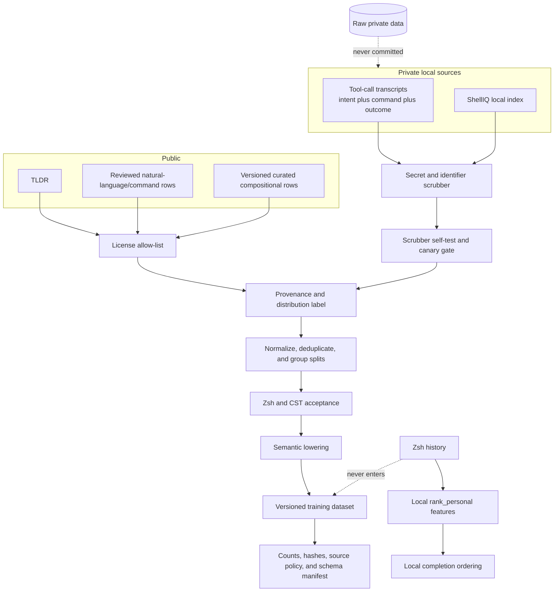
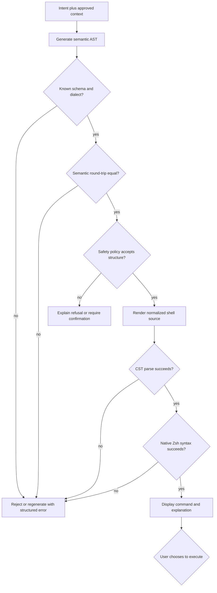

# ShellIQ AI pipeline architecture

This document sketches the stable boundaries of the data, training, and runtime
systems. It is deliberately independent of a particular post-training algorithm
or serving library. The detailed Zsh parser and AST contract lives in
[`training/SHELL_AST.md`](../training/SHELL_AST.md).

## End-to-end view

```mermaid
flowchart LR
    PUB[Public corpora] --> PROV[License and provenance gate]
    TX[Private tool transcripts] --> PRIV[Secret scrub and canary gate]
    PRIV --> PROV
    PROV --> DIALECT[Dialect parse gate]
    DIALECT --> CST[Lossless CST]
    CST --> LOWER[ShellIQ semantic lowerer]
    LOWER --> PAIRS[Intent and semantic-AST examples]
    PAIRS --> SFT[Supervised fine-tuning]
    SFT --> POST[Validator-guided post-training]
    POST --> ART[Versioned model artifact]

    INTENT[User intent and context] --> MODEL[Local model]
    ART --> MODEL
    MODEL --> DECODE[Constrained semantic-AST decode]
    MODEL -. failure .-> DOC[Vendored documentation compiler]
    DOC --> DECODE
    DECODE --> VALIDATE[Schema, semantic, and safety validation]
    VALIDATE --> RENDER[Deterministic renderer]
    RENDER --> NATIVE[Native shell syntax check]
    NATIVE --> SUGGEST[Command suggestion]

    HIST[Private shell history] --> PERSONAL[Local personal ranking only]
    PERSONAL --> SUGGEST

    VALIDATE -. structured reward .-> POST
    NATIVE -. syntax reward .-> POST
```

The initial declared dialect is Zsh. Portable commands may later receive a
separate POSIX `sh` compatibility label; Bash or `sh` parser support must be
added as explicit dialect profiles rather than mixed into Zsh training rows.

## Data lineage and privacy

Raw history is not a training pair: it normally lacks intent, does not prove that
a command succeeded, and can contain credentials or sensitive paths. Under the
current privacy policy it is used only for local `rank_personal` completion
ordering and never enters either the distributable dataset or a personal
adapter. Transcript tool calls are the high-value training source because they
can retain a problem statement, candidate command, validator result, execution
outcome, and correction. Private source files and derived personal-only datasets
stay outside Git; only their importers, policies, aggregate reports, and
reproducible manifests belong in the repository.

## Runtime validation

Validation produces structured failure categories, not just a Boolean. Those
categories support constrained regeneration during inference and denser reward
signals during post-training. Syntax validity is necessary but insufficient:
intent coverage, safety policy, and task success must be evaluated separately so
the model cannot earn high reward by emitting trivial valid commands.

## Current implementation boundary

- Implemented: strict dataset records, provenance and privacy gates, a reviewed
  curated compositional corpus, grouped splits, training/evaluation/export
  foundations, lossless Zsh CST parsing, and the first semantic lowering slice.
- The first semantic slice supports sequential simple commands, ordered words,
  `|` and `|&` pipelines, and common file redirects. Words remain validated
  lexical units for now.
- Required before a quality training run: structured word parts, the remaining
  Zsh statement families, semantic corpus conversion, semantic evaluation, and
  runtime constrained decoding.
- Planned: privacy-preserving history-based local ranking, portable-shell
  compatibility labeling, validator-guided post-training, and sandboxed
  task-success evaluation.
