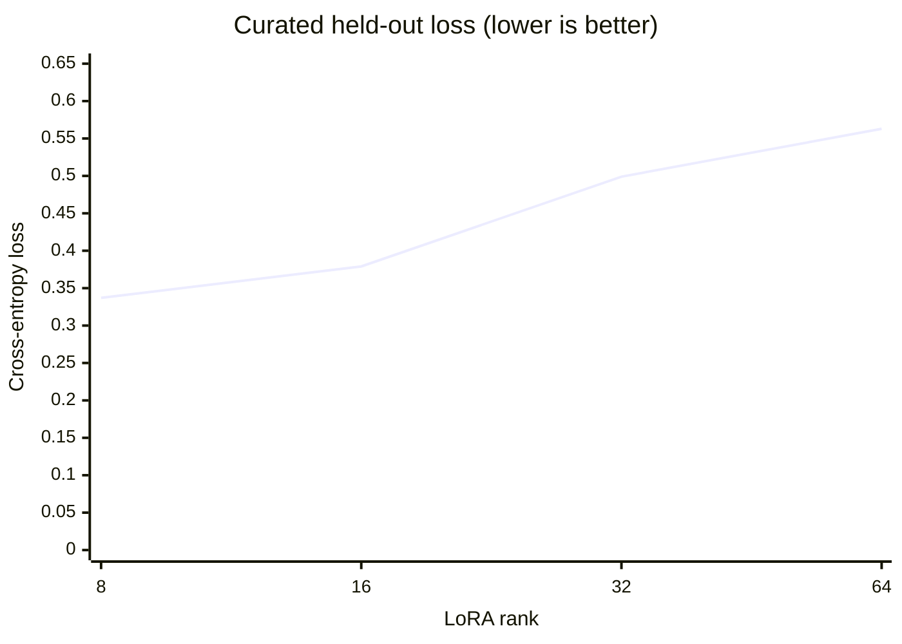
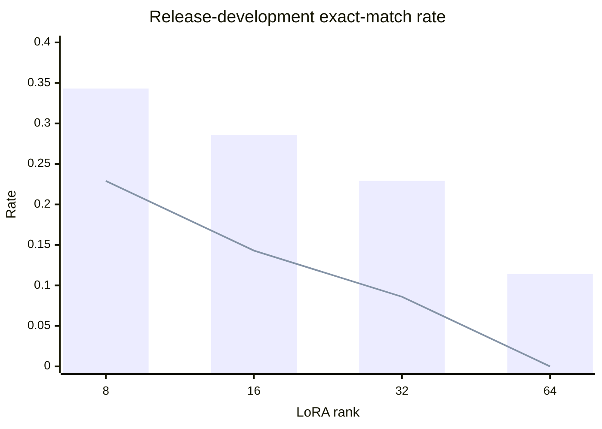
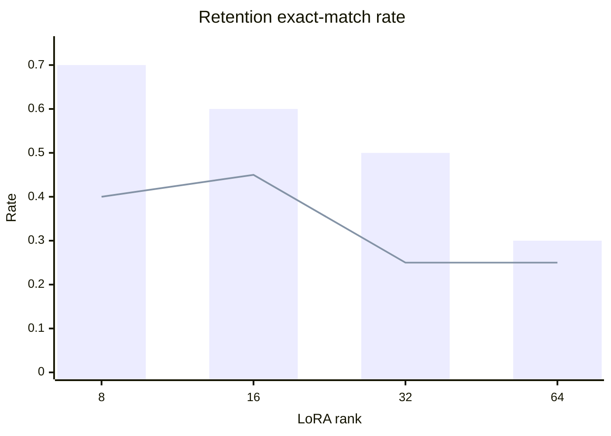

# LoRA rank fixed-recipe baseline v1

This experiment compares ranks under one fixed broad -> curated recipe with
`alpha / rank = 2`. It is a screening baseline, **not** a comparison of each
rank after independently tuning learning rate, training duration, warmup, or
regularization.

| Rank | Broad held-out loss | Curated held-out loss | Release flags | Release grounded | Retention flags | Retention grounded |
| ---: | ---: | ---: | ---: | ---: | ---: | ---: |
| 8 | 0.353 | 0.337 | 12/35 | 8/35 | 14/20 | 8/20 |
| 16 | 0.393 | 0.379 | 10/35 | 5/35 | 12/20 | 9/20 |
| 32 | 0.466 | 0.499 | 8/35 | 3/35 | 10/20 | 5/20 |
| 64 | 0.610 | 0.563 | 4/35 | 0/35 | 6/20 | 5/20 |

In the following plots, bars are exact command-plus-flag sequences and lines
are grounded-document exact matches.

Rank 8 is best under this recipe but misses the 13/35 release flag floor, so no
candidate is promoted and the final shadow holdout remains untouched. Because
larger ranks also have worse training-corpus held-out loss, the result does not
separate insufficient optimization from unsuitable capacity. The next capacity
diagnostic should record checkpoint-level learning curves and narrowly tune
learning rate/duration for ranks 16 and 32 before comparing their best-loss
checkpoints. A large rank/schedule grid is lower priority than verifier-backed
rejection-sampling and preference data.

Exact values are stored in
[`lora-rank-fixed-recipe-v1.json`](lora-rank-fixed-recipe-v1.json). Source reports
are the ignored local artifact roots `lora-rank-sweep-v1` and
`lora-rank-sweep-low-v1`; both manifests fingerprint their inputs.
